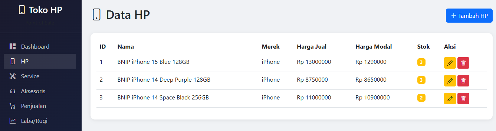
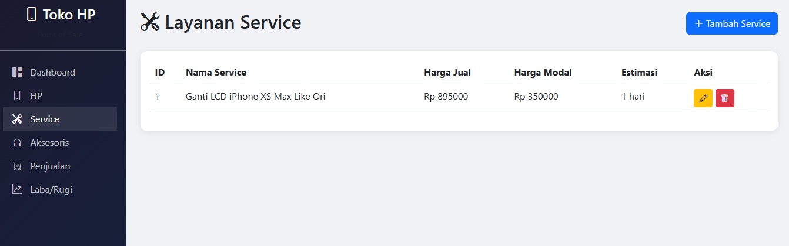
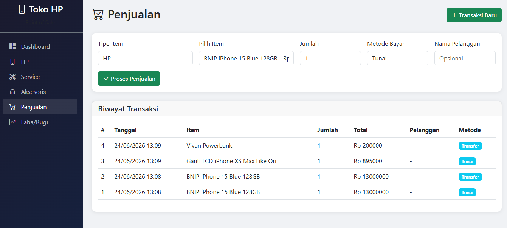
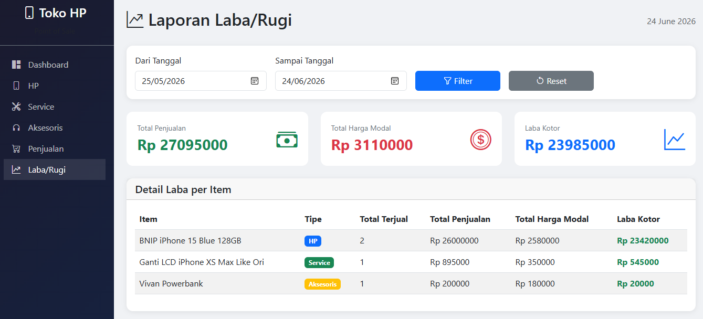

# 📱 Toko HP POS - Point of Sale System

## 📌 Deskripsi
Sistem manajemen penjualan untuk toko handphone berbasis web. Dibangun dengan **Flask** (Python) dan **SQLite** sebagai database. Aplikasi ini memungkinkan pemilik toko untuk mengelola data HP, jasa service, aksesoris, mencatat transaksi penjualan, serta melihat laporan laba/rugi secara real-time.

## 🚀 Fitur Utama
- ✅ **Manajemen Produk HP** – Tambah, edit, hapus data HP dengan harga jual, harga modal, dan stok.
- ✅ **Manajemen Jasa Service** – Kelola layanan service dengan harga dan estimasi pengerjaan.
- ✅ **Manajemen Aksesoris** – Kelola aksesoris HP dengan kategori, harga, dan stok.
- ✅ **Transaksi Penjualan** – Catat penjualan HP, service, atau aksesoris secara cepat.
- ✅ **Dashboard** – Lihat ringkasan total penjualan, laba kotor, dan jumlah transaksi.
- ✅ **Laporan Laba/Rugi** – Filter berdasarkan tanggal, tampilkan total penjualan, total harga modal, dan laba per item.
- ✅ **Stok Otomatis Berkurang** – Saat transaksi, stok akan otomatis berkurang sesuai jumlah terjual.

## 🛠️ Teknologi yang Digunakan
- **Backend**: Python 3, Flask, Flask-SQLAlchemy
- **Database**: SQLite (ringan, tanpa instalasi server)
- **Frontend**: HTML5, CSS3, Bootstrap 5, JavaScript, Bootstrap Icons
- **Tools**: Jupyter Notebook (untuk pengembangan), Git

## 📷 Tampilan Website
> (Tambahkan screenshot di sini nanti)
> Contoh:
> 
> 
> 
> 
> 
> 


## ⚙️ Cara Menjalankan Project di Lokal

### Prasyarat
- Python 3.8 atau lebih baru
- pip (package manager Python)

### Langkah-langkah
1. **Clone repository**
   ```bash
   git clone [https://github.com/putuwrdn87-debug/Toko-HP-POS]

2. Buat virtual environment (opsional tapi disarankan)
    python -m venv venv
    source venv/bin/activate      # Linux/Mac
    venv\Scripts\activate         # Windows

3. Install dependencies
   pip install flask flask-sqlalchemy
   
4. Jalankan aplikasi
   python app.py (Jika menggunakan Jupyter Notebook, buka file .ipynb dan jalankan semua cell secara berurutan)
   
5. Buka browser dan akses:
   http://127.0.0.1:5000

Contoh Penggunaan:
1. Buka menu HP → Tambahkan beberapa HP dengan harga jual dan harga modal.
2. Buka menu Aksesoris → Tambahkan casing, charger, dll.
3. Buka menu Service → Tambahkan layanan service.
4. Buka menu Penjualan → Pilih item, tentukan jumlah, dan simpan transaksi.
5. Buka menu Laba/Rugi → Filter tanggal untuk melihat laporan keuangan.

Author:

Putu Wardani

Lisensi:

Project ini dibuat untuk keperluan portofolio dan pembelajaran. Silakan digunakan dan dikembangkan lebih lanjut.
